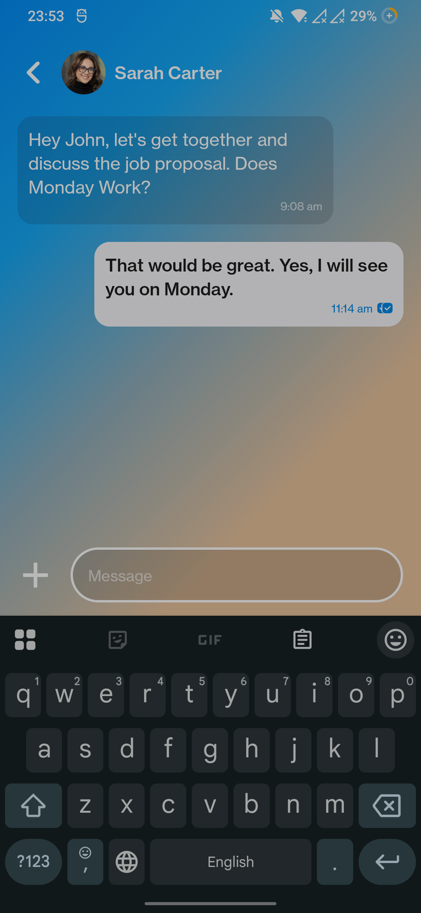

# AryaCommunication

**AryaCommunication** is an Android application that facilitates real-time messaging and communication.

## Features

-   **Real-time Messaging:** Send and receive messages instantly.
-   **User Profiles:** Manage and customize your user profile.
-   **Message overlay**: Display an overlay over the main screen to get more involment via media messages from sender to receiver.

## Tech Stack

-   **Kotlin:** The primary programming language.
-   **Android Jetpack:**
    -   **Compose:** For building the user interface.
    -   **ViewModel:** For managing UI-related data and lifecycle.
    -   **Lifecycle-Runtime-Compose**: support for lifecycle in compose
    -   **Activity-Compose**: support for activity in compose
    -   **Animation**: Provide animations
    - **Foundation**: provide the foundation for the app
    - **Material3**: support for material design 3
    - **Material**: Support for material design
   
## Getting Started

These instructions will get you a copy of the project up and running on your local machine for development and testing purposes.

### Prerequisites

-   Android Studio Giraffe | 2022.3.1 or higher
-   Android SDK API 34 or higher
-   Git

### Installation

1.  Clone the repository:
2.  Open the project in Android Studio.
3.  Sync Gradle files.
4.  Build and run the app on an emulator or physical device.

## Project Structure

Here's a detailed breakdown of the project's directory structure:

AryaCommunication/
├── app/                                  # Android application module
│   ├── build.gradle.kts                  # Build configuration for the app module
│   ├── proguard-rules.pro                # ProGuard rules for code obfuscation
│   ├── src/
│   │   ├── main/                         # Main application source set
│   │   │   ├── AndroidManifest.xml          # Application manifest file
│   │   │   ├── java/                       # Kotlin source code
│   │   │   │   └── com/
│   │   │   │       └── iamkjn/
│   │   │   │           └── aryacommunication/ # Root package
│   │   │   │               ├── ui/         # UI layer (Compose)
│   │   │   │               │   ├── components/ # Reusable UI components
│   │   │   │               │   │   ├── MessageBubble.kt
│   │   │   │               │   │   └── MessageInput.kt
│   │   │   │               │   │   ├── MessageOverlay.kt
│   │   │   │               │   │   └── ScreenContent.kt
│   │   │   │               │   │   ├── TopBar.kt
│   │   │   │               │   ├── screen/     # Screens in the app
│   │   │   │               │   │   └── MessagingScreen.kt
│   │   │   │               │   ├── theme/      # App theming
│   │   │   │               │   │   ├── Color.kt
│   │   │   │               │   │   └── Theme.kt
│   │   │   │               │   └── viewmodel/  # ViewModel classes
│   │   │   │               │       └── MessagingViewModel.kt
│   │   │   │               └── MainActivity #Use as a Launcher
│   │   │   ├── res/                          # Resources
│   │   │   │   ├── drawable/                 # Image assets
│   │   │   │   ├── mipmap-hdpi/              # Launcher icons
│   │   │   │   ├── mipmap-mdpi/
│   │   │   │   ├── mipmap-xhdpi/
│   │   │   │   ├── mipmap-xxhdpi/
│   │   │   │   ├── mipmap-xxxhdpi/
│   │   │   │   ├── values/                   # Value resources
│   │   │   │   │   ├── colors.xml              # Color definitions
│   │   │   │   │   ├── strings.xml             # String resources
│   │   │   │   │   └── themes.xml              # Theme files
│   │   │   │   └── ...
│   │   │   └── ...
│   └── ...
├── build.gradle.kts                      # Project-level build configuration
├── gradle/                               # Gradle files
│   └── libs.versions.toml                # Version catalog file
├── gradlew                               # Gradle wrapper script (Linux/macOS)
├── gradlew.bat                           # Gradle wrapper script (Windows)
├── settings.gradle.kts                   # Project settings
└── ...                                   # Other project files (e.g., .gitignore, README.md)

# Visual Representation of UI & Animation

Here are some screenshots of the app:

Here's an apk link:

[Google Drive](https://drive.google.com/file/d/1bzm_3_oXgGWgMPxSUUEHYSYF2vg-lNhn/view?usp=sharing)
        
